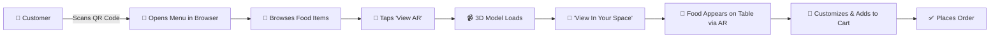

<div align="center">

# 🍽️ plattAR — AR Menu Service

### _The Future of Restaurant Dining, Powered by Augmented Reality_

[](https://react.dev)
[](https://vitejs.dev)
[](https://tailwindcss.com)
[](https://modelviewer.dev)
[](LICENSE)

<br/>

> **plattAR** transforms the traditional restaurant menu into an immersive, interactive AR experience.  
> Customers can visualize photo-realistic 3D food models on their table using their phone camera — _no app installation required._

<br/>

---

</div>

## 📋 Table of Contents

- [Overview](#-overview)
- [Key Features](#-key-features)
- [Live Demo](#-live-demo)
- [Tech Stack](#-tech-stack)
- [Architecture](#-architecture)
- [Project Structure](#-project-structure)
- [Getting Started](#-getting-started)
  - [Prerequisites](#prerequisites)
  - [Installation](#installation)
  - [Running Locally](#running-locally)
  - [Building for Production](#building-for-production)
- [How It Works](#-how-it-works)
- [Screens & Pages](#-screens--pages)
- [3D Models & Menu Data](#-3d-models--menu-data)
- [State Management](#-state-management)
- [SEO & Meta Tags](#-seo--meta-tags)
- [Deployment](#-deployment)
- [Device Compatibility](#-device-compatibility)
- [Future Roadmap](#-future-roadmap)
- [Contributing](#-contributing)
- [License](#-license)
- [Authors](#-authors)

---

## 🌟 Overview

Traditional restaurant menus fail to convey the true appearance, portion size, and presentation quality of dishes. **plattAR** solves this by providing:

- **WebAR-powered food visualization** — Place 3D dishes directly on your dining table via your phone camera
- **Interactive 3D previews** — Rotate, zoom, and inspect every dish from any angle
- **Smart ordering flow** — Customize ingredients, view nutrition info, and add to cart seamlessly
- **QR code table integration** — Scan a table QR code to instantly open the digital menu on any device
- **Zero friction** — Runs entirely in the browser; no app download needed

This project leverages Google's **`<model-viewer>`** web component for rendering high-fidelity `.glb` 3D models and enabling native AR experiences via **ARCore** (Android) and **ARKit** (iOS).

---

## ✨ Key Features

### 🍔 Immersive 3D Food Visualization
- Photo-realistic `.glb` 3D food models rendered in the browser
- Full **rotate**, **zoom**, and **pan** interaction via `<model-viewer>`
- Auto-rotation with configurable speed and shadow intensity
- Floating animation effect on the AR Viewer page

### 📱 Real-Time Augmented Reality
- **One-tap AR placement** — View any dish on your real table using your phone camera
- Supports `webxr`, `scene-viewer` (Android), and `quick-look` (iOS) AR modes
- No app installation required — fully browser-based
- Works on both Android (ARCore) and iOS (ARKit) devices

### 🎨 Premium Dark-Themed UI
- Futuristic **dark-mode** interface with deep navy (`#050A15`) backgrounds
- Custom **glassmorphism** effects with backdrop blur and soft borders
- **Holographic card animations** with CSS shine effects
- **Mesh gradient backgrounds** with multi-color radial gradients
- **Cyber button** hover effects with sweeping light animations
- Smooth page transitions powered by **Framer Motion**

### 🛒 Smart Cart System
- Add dishes to cart from the Menu page or the AR Viewer
- **Ingredient customization** — Toggle individual ingredients on/off per dish
- **Special instructions** — Free-text field for allergies or cooking preferences
- **Dynamic nutrition recalculation** based on selected/removed ingredients
- Animated slide-in cart drawer with quantity controls
- Real-time total pricing

### 🔗 QR Code Integration
- Built-in **QR code generator** using `qrcode.react`
- Modal popup with scannable QR code for instant mobile access
- Designed for restaurant table deployment

### 🎬 Cinematic Video Hero
- Full-screen background video on the landing page
- Gradient overlays for text readability
- Mute/unmute toggle with animated floating button

### 🔍 SEO Optimized
- Dynamic `<title>` and `<meta>` tags per page via `react-helmet-async`
- Open Graph and Twitter Card meta tags for rich social sharing
- Semantic HTML structure

---

## 🛠 Tech Stack

| Layer | Technology | Version | Purpose |
|-------|-----------|---------|---------|
| **Frontend Framework** | React | 19.2 | Component-based UI |
| **Build Tool** | Vite | 8.0 | Lightning-fast dev server & bundler |
| **Styling** | Tailwind CSS | 4.3 | Utility-first CSS framework |
| **Animations** | Framer Motion | 12.38 | Declarative animations & transitions |
| **3D / AR Engine** | @google/model-viewer | 4.2 | WebAR & 3D model rendering |
| **State Management** | Zustand | 5.0 | Lightweight global state |
| **Routing** | React Router DOM | 7.15 | Client-side page routing |
| **SEO** | react-helmet-async | 3.0 | Dynamic document head management |
| **Notifications** | react-hot-toast | 2.6 | Toast notification system |
| **QR Codes** | qrcode.react | 4.2 | QR code generation |
| **Linting** | ESLint | 10.3 | Code quality enforcement |
| **Deployment** | Vercel | — | Serverless hosting with SPA rewrites |

---

## 🏛 Architecture

```
┌──────────────────────────────────────────────────────────┐
│                        Browser                           │
│  ┌────────────────────────────────────────────────────┐  │
│  │               React 19 (SPA)                       │  │
│  │  ┌──────────┐  ┌──────────┐  ┌──────────────────┐ │  │
│  │  │  Home    │  │  Menu    │  │  AR Viewer       │ │  │
│  │  │  Page    │  │  Page    │  │  /ar/:id         │ │  │
│  │  │          │  │          │  │                   │ │  │
│  │  │ • Video  │  │ • Grid   │  │ • <model-viewer> │ │  │
│  │  │ • Hero   │  │ • Filter │  │ • AR Mode        │ │  │
│  │  │ • Stats  │  │ • Cards  │  │ • Ingredient     │ │  │
│  │  │ • QR     │  │ • Cart   │  │   Customization  │ │  │
│  │  └──────────┘  └──────────┘  │ • Nutrition      │ │  │
│  │                              └──────────────────┘ │  │
│  │  ┌───────────────────────────────────────────────┐ │  │
│  │  │         Shared Components                     │ │  │
│  │  │  Navbar │ CartDrawer │ QRCodeModal │ SEO      │ │  │
│  │  └───────────────────────────────────────────────┘ │  │
│  │  ┌───────────────────────────────────────────────┐ │  │
│  │  │  Zustand Store (cartStore.js)                 │ │  │
│  │  │  • items[] • addItem • updateQuantity         │ │  │
│  │  │  • removeItem • clearCart                     │ │  │
│  │  └───────────────────────────────────────────────┘ │  │
│  └────────────────────────────────────────────────────┘  │
│                          │                               │
│              Vite Dev Server / Build                     │
│              Tailwind CSS 4 (JIT)                        │
└──────────────────────────────────────────────────────────┘
         │                              │
    /data/menu.json              /models/*.glb
    (Menu Config)              (3D Food Models)
```

---

## 📂 Project Structure

```
plattAR---AR-Menu-Service/
│
├── model-viewer-master/            # Main application root
│   ├── index.html                  # SPA entry point
│   ├── package.json                # Dependencies & scripts
│   ├── vite.config.js              # Vite + React + Tailwind config
│   ├── vercel.json                 # Vercel SPA rewrite rules
│   ├── eslint.config.js            # ESLint configuration
│   ├── LICENSE                     # Apache 2.0 License
│   │
│   ├── src/
│   │   ├── main.jsx                # React entry — HelmetProvider + model-viewer import
│   │   ├── App.jsx                 # Root component — Router, Navbar, Routes, Footer
│   │   ├── App.css                 # Legacy/additional component styles
│   │   ├── index.css               # Global styles — design tokens, glassmorphism,
│   │   │                           #   mesh gradients, animations, cyber buttons
│   │   │
│   │   ├── pages/
│   │   │   ├── Home.jsx            # Landing page — video hero, stats, CTA, QR modal
│   │   │   ├── Menu.jsx            # Menu page — category filter, food cards, 3D previews
│   │   │   └── ARViewer.jsx        # AR detail page — full 3D viewer, ingredients,
│   │   │                           #   nutrition bars, special instructions, add-to-cart
│   │   │
│   │   ├── components/
│   │   │   ├── CartDrawer.jsx      # Slide-in cart drawer — order summary, quantity controls
│   │   │   ├── QRCodeModal.jsx     # QR code popup for instant mobile menu access
│   │   │   └── SEO.jsx             # Dynamic <head> meta tag manager
│   │   │
│   │   ├── store/
│   │   │   └── cartStore.js        # Zustand store — cart items, add/update/remove/clear
│   │   │
│   │   └── assets/
│   │       ├── hero.png            # Hero section image asset
│   │       ├── react.svg           # React logo
│   │       └── vite.svg            # Vite logo
│   │
│   ├── public/
│   │   ├── favicon.svg             # App favicon
│   │   ├── icons.svg               # Icon sprite sheet
│   │   ├── restaurant_bg.png       # Background image
│   │   ├── restaurant_hero.png     # Hero background image
│   │   ├── _redirects              # Netlify redirect rules
│   │   │
│   │   ├── data/
│   │   │   └── menu.json           # Complete menu dataset (11 items)
│   │   │                           #   with prices, ingredients, nutrition, 3D model paths
│   │   │
│   │   ├── models/                 # 3D food models in GLB format
│   │   │   ├── burger_realistic_free.glb
│   │   │   ├── chicken_meal.glb
│   │   │   ├── coffee_cup.glb
│   │   │   ├── creamed_coffee.glb
│   │   │   ├── fish.glb
│   │   │   ├── food.glb
│   │   │   ├── momo_food.glb
│   │   │   ├── orange_juice.glb
│   │   │   ├── pizza.glb
│   │   │   ├── shrek_breakfast.glb
│   │   │   └── sushi_boat_nigiri.glb
│   │   │
│   │   └── Vedio/
│   │       └── *.mp4               # Hero section background video
│   │
│   └── ar-restaurant/              # Scaffolding / earlier prototype (reference)
│
├── .npmrc                          # npm configuration
├── .vscode/                        # VS Code workspace settings
└── README.md                       # ← You are here
```

---

## 🚀 Getting Started

### Prerequisites

| Requirement | Minimum Version |
|------------|----------------|
| **Node.js** | v18.0+ |
| **npm** | v9.0+ (comes with Node) |
| **Git** | Latest |
| **Modern Browser** | Chrome 91+, Safari 15+, Edge 91+ |

### Installation

**1. Clone the repository**

```bash
git clone https://github.com/uchiha-sasuke-03/plattAR---AR-Menu-Service.git
cd plattAR---AR-Menu-Service
```

**2. Navigate to the application directory**

```bash
cd model-viewer-master
```

**3. Install dependencies**

```bash
npm install
```

### Running Locally

```bash
npm run dev
```

The development server will start at:

```
http://localhost:5173
```

> **💡 Tip:** For the best AR experience, open the URL on an AR-supported mobile device (Android with ARCore or iPhone/iPad with ARKit). You can use your local network IP to access from your phone.

### Building for Production

```bash
npm run build
```

The production bundle will be generated in the `dist/` directory.

To preview the production build locally:

```bash
npm run preview
```

---

## 🧠 How It Works



### Step-by-Step User Journey

1. **Scan** — Customer scans a table QR code (or navigates to the URL)
2. **Browse** — The digital menu loads with interactive food cards showing 3D previews
3. **Filter** — Category filters (Mains, Starters, Indian, Japanese, Seafood, Breakfast, Desserts, Drinks)
4. **Preview** — Each card shows an auto-rotating 3D model via `<model-viewer>`
5. **AR View** — Tapping the AR button opens a full-screen 3D viewer with a "View In Your Space" button
6. **Place in AR** — The dish appears at real scale on the customer's table through their camera
7. **Customize** — Toggle ingredients on/off, add special instructions, view dynamic nutrition data
8. **Order** — Add to cart, review the order in the slide-in cart drawer, and place the order

---

## 📸 Screens & Pages

### 🏠 Home Page (`/`)
- **Cinematic video background** with gradient overlays
- **Hero section** with animated typography ("Taste With Your Eyes")
- **Call-to-action buttons** — "Explore Menu" and "Try AR Demo"
- **Stats strip** — 13+ AR Dishes, 4.8 Guest Rating, 100% AR Enabled
- **Floating scroll indicator** with bounce animation
- **Audio mute/unmute** toggle for the background video

### 🍕 Menu Page (`/menu`)
- **Category filter bar** with horizontal scroll and active state highlighting
- **Responsive grid** of food cards (1/2/3 columns based on viewport)
- **Each card includes:**
  - Auto-rotating 3D model preview
  - Category badge and "AR READY" indicator with pulse animation
  - Name, price (₹), description, rating, prep time, and calories
  - "Add to Cart" and "View AR" action buttons

### 🥽 AR Viewer Page (`/ar/:id`)
- **Split layout** — 3D viewport (left) + Detail panel (right)
- **Full interactive 3D viewer** with camera controls, auto-rotate, and shadow
- **"View In Your Space"** AR activation button
- **Ingredient customization** — Grid of toggleable ingredient pills
- **Nutritional breakdown** — Animated progress bars for Protein, Carbs, Fats
  - Dynamically recalculates based on selected ingredients
- **Special instructions** textarea
- **"Add to Order"** CTA button

### 🛒 Cart Drawer (overlay)
- **Slide-in panel** with spring animation
- **Per-item display** with removed ingredient badges and special instructions
- **Quantity controls** (+/−) and remove button
- **Order total** with "Place Order" button

---

## 🎮 3D Models & Menu Data

### Menu Items (11 dishes)

| # | Dish | Category | Price (₹) | 3D Model |
|---|------|----------|-----------|----------|
| 1 | Gourmet Chicken Burger | Mains | 649 | `burger_realistic_free.glb` |
| 2 | Crispy Chicken Meal | Mains | 849 | `chicken_meal.glb` |
| 3 | Classic Pepperoni Pizza | Mains | 999 | `pizza.glb` |
| 4 | Imperial Sushi Boat | Japanese | 1,899 | `sushi_boat_nigiri.glb` |
| 5 | Grilled Lemon Fish | Seafood | 1,299 | `fish.glb` |
| 6 | Steamed Himalayan Momos | Starters | 399 | `momo_food.glb` |
| 7 | Shrek's Morning Feast | Breakfast | 749 | `shrek_breakfast.glb` |
| 8 | Velvet Cream Latte | Drinks | 299 | `creamed_coffee.glb` |
| 9 | Fresh Squeezed Orange | Drinks | 225 | `orange_juice.glb` |
| 10 | Artisan Espresso | Drinks | 175 | `coffee_cup.glb` |
| 11 | Chef's Fusion Platter | Mains | 1,499 | `food.glb` |

### Menu Data Format (`public/data/menu.json`)

Each menu item follows this schema:

```json
{
  "id": "burger",
  "name": "Gourmet Chicken Burger",
  "price": 649,
  "ingredients": ["Chicken Patty", "Crispy Lettuce", "Sliced Tomato", "Cheddar Cheese", "Brioche Bun"],
  "nutrition": {
    "protein": 35,
    "carbs": 45,
    "fats": 25,
    "calories": 540
  },
  "description": "A premium grilled chicken burger with our secret sauce...",
  "model": "/models/burger_realistic_free.glb",
  "category": "Mains",
  "rating": 4.8,
  "reviews": 312,
  "time": "15 min"
}
```

### Adding a New Menu Item

1. Place your `.glb` 3D model file in `public/models/`
2. Add a new entry to `public/data/menu.json` following the schema above
3. The new dish will automatically appear in the menu with full 3D preview and AR support

---

## 🗃 State Management

The app uses **Zustand** for global cart state via `src/store/cartStore.js`:

```javascript
// Store API
useCartStore.getState().addItem(item)         // Add item (auto-increments if duplicate)
useCartStore.getState().updateQuantity(idx, qty)  // Update quantity (removes if 0)
useCartStore.getState().removeItem(idx)        // Remove item by index
useCartStore.getState().clearCart()             // Clear entire cart
```

**Key behaviors:**
- Duplicate detection via `id` + `selectedIngredients` comparison
- Automatic quantity increment for exact duplicates
- Items auto-removed when quantity reaches 0

---

## 🔍 SEO & Meta Tags

The `SEO` component (`src/components/SEO.jsx`) manages dynamic document head metadata using `react-helmet-async`:

- **Per-page titles** — `"Home | ChickenAR | Premium WebAR Dining"`
- **Meta descriptions** — Unique per route
- **Open Graph tags** — `og:type`, `og:title`, `og:description`, `og:image`
- **Twitter Card tags** — `twitter:card`, `twitter:title`, `twitter:description`, `twitter:image`

Usage in any page:
```jsx
<SEO title="Menu" description="Explore our futuristic AR menu." />
```

---

## 🚢 Deployment

### Vercel (Recommended)

The project includes a `vercel.json` configuration for SPA routing:

```json
{
  "rewrites": [{ "source": "/(.*)", "destination": "/index.html" }]
}
```

**Deploy steps:**
1. Push to GitHub
2. Import the repository on [vercel.com](https://vercel.com)
3. Set the **Root Directory** to `model-viewer-master`
4. Framework Preset: **Vite**
5. Deploy ✅

### Netlify

A `_redirects` file is included in `public/` for Netlify SPA routing:
```
/*    /index.html   200
```

### Other Platforms

Build the production bundle and serve the `dist/` folder:
```bash
cd model-viewer-master
npm run build
# Serve the dist/ directory with any static file server
```

---

## 📱 Device Compatibility

| Platform | 3D Preview | AR Experience | Notes |
|----------|-----------|---------------|-------|
| **Android** (Chrome) | ✅ Full | ✅ ARCore | Best experience on Pixel, Samsung Galaxy |
| **iOS** (Safari) | ✅ Full | ✅ ARKit/Quick Look | iPhone 6S+ and iPad Pro+ |
| **Desktop** (Chrome/Edge/Firefox) | ✅ Full | ⚠️ 3D Only | No AR camera access on desktop |
| **Desktop** (Safari) | ✅ Full | ⚠️ 3D Only | No AR camera access on desktop |

> **📌 Note:** AR features require an AR-capable device with a camera. On desktop browsers, users can still interact with the full 3D models (rotate, zoom, pan) — only the "View In Your Space" AR placement requires a mobile device.

---

## 🔮 Future Roadmap

- [ ] 🤖 **AI-powered food recommendations** — Suggest dishes based on preferences and past orders
- [ ] 🧾 **Voice-enabled ordering** — Natural language order assistant
- [ ] 🍽️ **Restaurant admin dashboard** — Menu management, order tracking, analytics
- [ ] 🌐 **Multi-language support** — i18n for global restaurant chains
- [ ] 💳 **Online payment integration** — Stripe/Razorpay checkout flow
- [ ] 🧠 **AI nutrition analysis** — Personalized dietary insights
- [ ] 📊 **Analytics dashboard** — Customer behavior, popular dishes, AR engagement metrics
- [ ] 🔔 **Push notifications** — Order status updates
- [ ] 👥 **Multi-user shared ordering** — Group dining support

---

## 🤝 Contributing

Contributions are welcome! Here's how to get started:

1. **Fork** this repository
2. **Create** a feature branch:
   ```bash
   git checkout -b feature/amazing-feature
   ```
3. **Commit** your changes:
   ```bash
   git commit -m "feat: add amazing feature"
   ```
4. **Push** to the branch:
   ```bash
   git push origin feature/amazing-feature
   ```
5. **Open a Pull Request** 🎉

### Development Guidelines

- Follow the existing code style and component patterns
- Use Tailwind CSS utility classes for styling
- Add menu items via `public/data/menu.json` — no hardcoded data
- Place 3D models (`.glb` format) in `public/models/`
- Test AR features on a physical mobile device

---

## 📜 License

This project is licensed under the **Apache License 2.0**. See the [LICENSE](model-viewer-master/LICENSE) file for details.

---

## 👨‍💻 Authors

<div align="center">

**Built with ❤️ and AR magic**

Developed by **Anupam** ([@uchiha-sasuke-03](https://github.com/uchiha-sasuke-03))

---

_If you found this project interesting, please consider giving it a ⭐_

</div>
